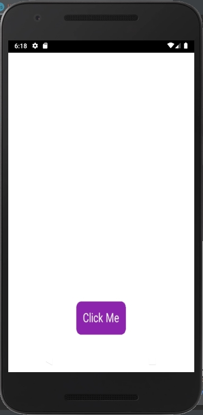

# fltk-rs-android

An example counter app using fltk-rs on Android.



## Requirements
- Android Studio
- Android ndk

## Usage
- Make sure you have the targets installed:
```
rustup target add aarch64-linux-android armv7-linux-androideabi i686-linux-android x86_64-linux-android
```
- Clone the repo
- Open in Android Studio
- In the Android Studio terminal, set the ANDROID_SDK_ROOT and ANDROID_NDK_ROOT environment variables. 
For windows, it's usually something like:
```
set ANDROID_SDK_ROOT=C:\Users\<user>\AppData\Local\Android\Sdk
set ANDROID_NDK_ROOT=C:\Users\<user>\AppData\Local\Android\Sdk\ndk\21.0.6113669
```
For posix systems:
```
export ANDROID_SDK_ROOT=$HOME/Library/Android/sdk
export ANDROID_NDK_ROOT=$ANDROID_SDK_ROOT/ndk/21.0.6113669
```
- From the terminal, run the build for your emulator's triple, assuming it's a Nexus 5 x86:
```
cd app\src\main\cpp\app (windows)
cd app/src/main/cpp/app (posix)
cargo build --target i686-linux-android
```
- Hit the Run App button
